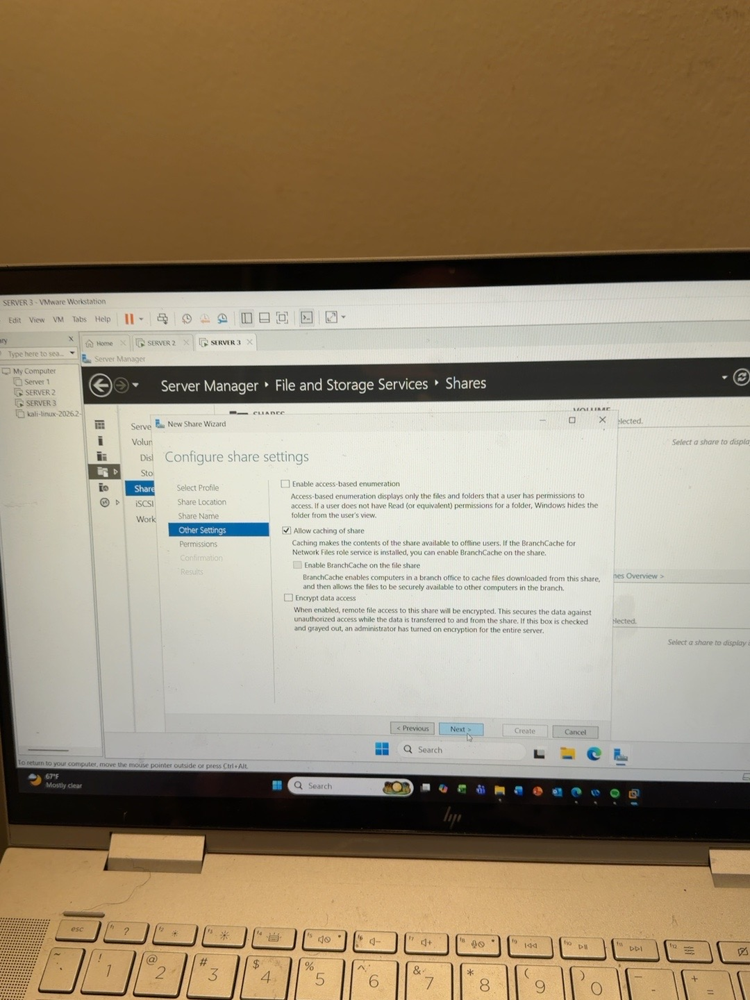
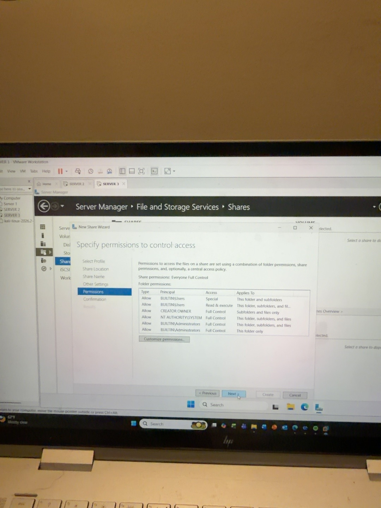
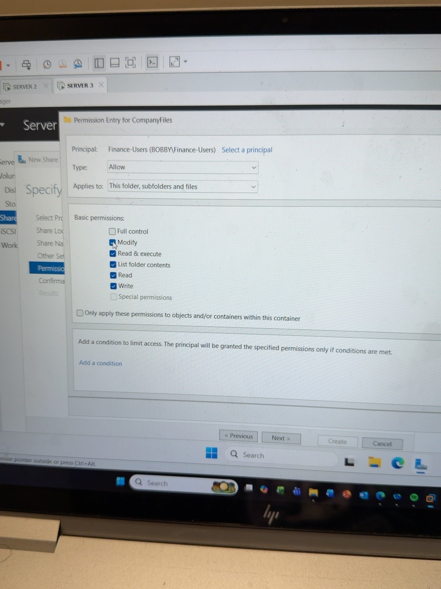
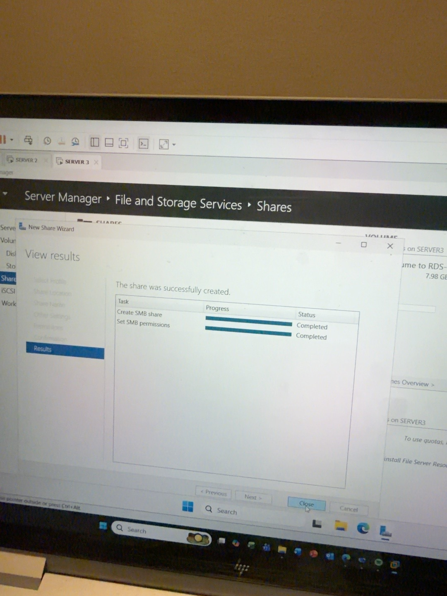
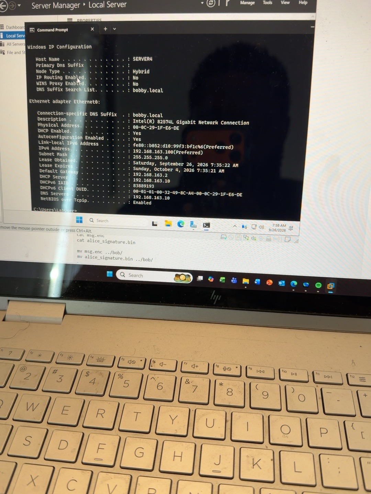
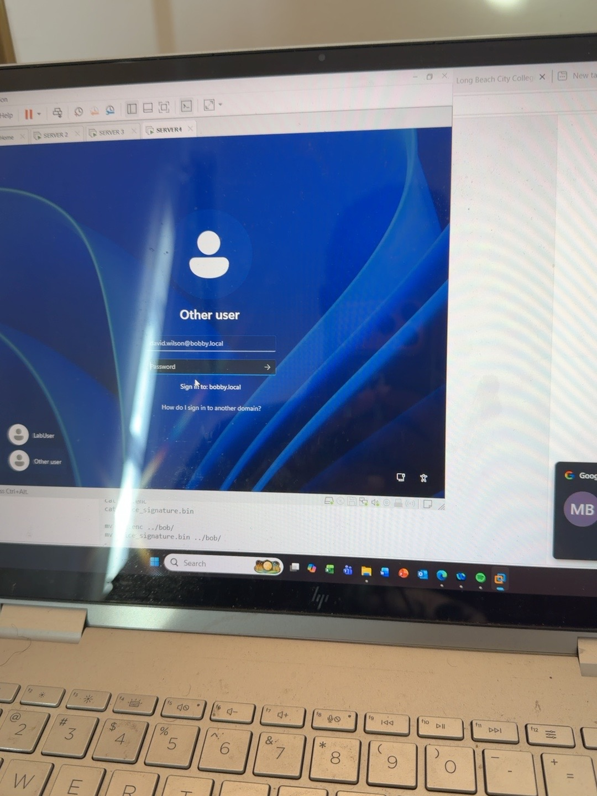
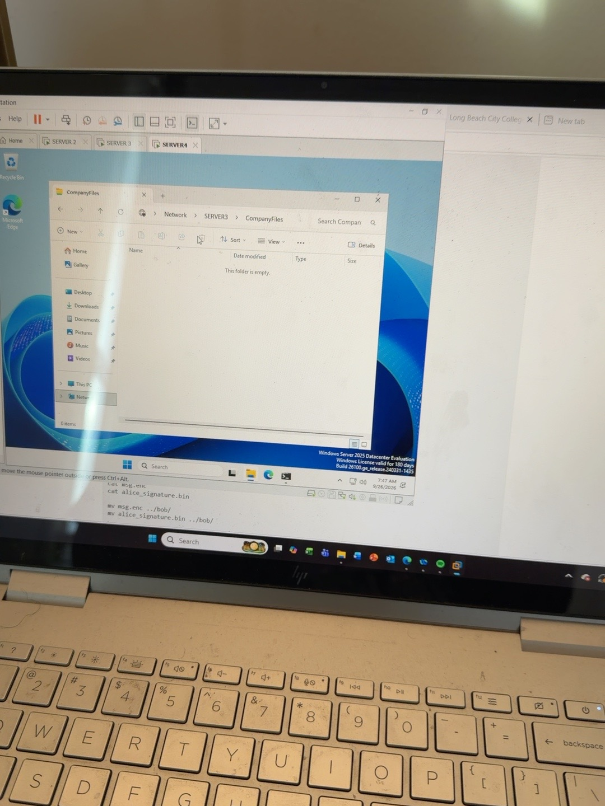
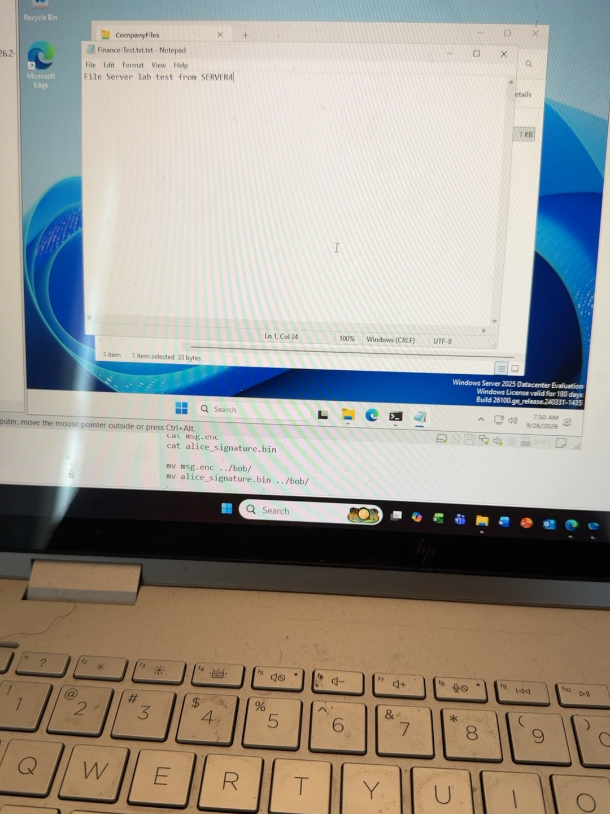

# Windows Server File Server and SMB Share Lab

## Overview

In this lab, I installed and configured the File Server role on Windows Server and created an SMB network share.

The shared folder was stored on a mirrored Storage Spaces volume and access was controlled using an Active Directory security group.

I then tested the share from a separate domain-joined server using a normal domain user account.

## Lab Environment

- Virtualization Platform: VMware Workstation
- Domain: bobby.local
- File Server: SERVER3
- Client/Test Server: SERVER4
- Domain Controller / DNS Server: SERVER2
- Operating System: Windows Server 2025
- Storage Volume: E:
- Share Name: CompanyFiles
- Protocol: SMB

## Lab Objectives

- Install the File Server role
- Create an SMB share
- Store the share on the mirrored E: volume
- Configure group-based permissions
- Join SERVER4 to the domain
- Test access using a normal domain user
- Verify file creation and write access

## File Server Role Installation

I installed the File Server role from:

Server Manager → Add Roles and Features → File and Storage Services → File and iSCSI Services → File Server

After installation, the Shares section became available under File and Storage Services.

## SMB Share Configuration

I created a new SMB Share using:

SMB Share - Quick

The share was configured with the following settings:

- Server: SERVER3
- Share Name: CompanyFiles
- Local Path: E:\Shares\CompanyFiles
- Network Path: \\SERVER3\CompanyFiles
- Protocol: SMB

## Permissions

Instead of assigning permissions directly to individual users, I used the Active Directory security group:

Finance-Users

The group was assigned Modify permissions.

This allows members of the group to:

- Read files
- Create files
- Edit files
- Delete files
- Create folders

Administrators and SYSTEM retained administrative access.

## SERVER4 Client Configuration

I created SERVER4 as a separate test machine.

SERVER4 was configured with:

- Hostname: SERVER4
- IPv4 Address: 192.168.163.100
- Subnet Mask: 255.255.255.0
- Default Gateway: 192.168.163.2
- DNS Server: 192.168.163.10
- Domain: bobby.local

SERVER4 was successfully joined to the bobby.local Active Directory domain.

## User Access Test

I signed into SERVER4 using a normal domain user account that belongs to the Finance-Users group.

The shared folder was accessed using:

\\SERVER3\CompanyFiles

The user successfully created and saved:

Finance-Test.txt

with the text:

File Server lab test from SERVER4

This confirmed that the SMB share and group permissions were working correctly.

## What I Learned

- File Server roles provide centralized file sharing.
- SMB is used for Windows network file sharing.
- Share permissions and NTFS permissions work together.
- Security groups should be used instead of assigning permissions directly to individual users.
- DNS must be configured correctly before joining a server to a domain.
- A separate client machine is useful for testing real user access.
- The principle of least privilege is better than giving users Full Control.
- File shares can be stored on resilient Storage Spaces volumes.

## Troubleshooting and Validation

The lab was validated by confirming:

- SERVER4 could resolve and access SERVER3
- SERVER4 successfully joined bobby.local
- The normal user could open \\SERVER3\CompanyFiles
- The user could create and save Finance-Test.txt
- The file remained in the shared folder after saving

## Result

The File Server lab was successfully completed.

A domain user with the correct group membership was able to access and modify files on a centralized SMB share hosted on SERVER3.

## Lab Evidence

### 1. SMB Share Configuration

### 2. File and Folder Permissions

### 3. Finance-Users Group Permission

### 4. SMB Share Successfully Created

### 5. SERVER4 Network and DNS Configuration

### 6. SERVER4 Domain User Login

### 7. Accessing CompanyFiles from SERVER4

### 8. Successful File Creation Test

