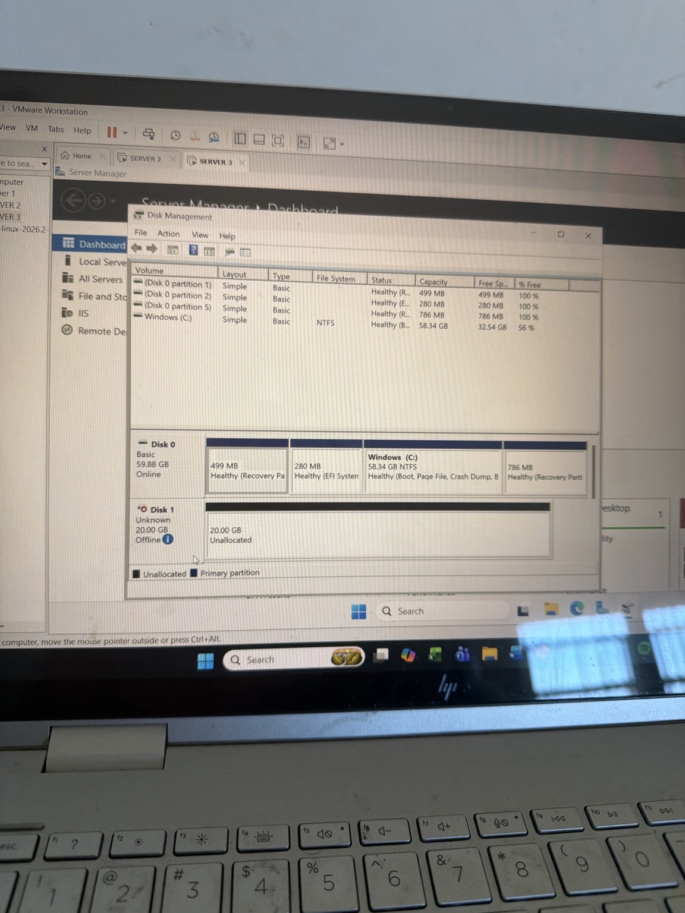
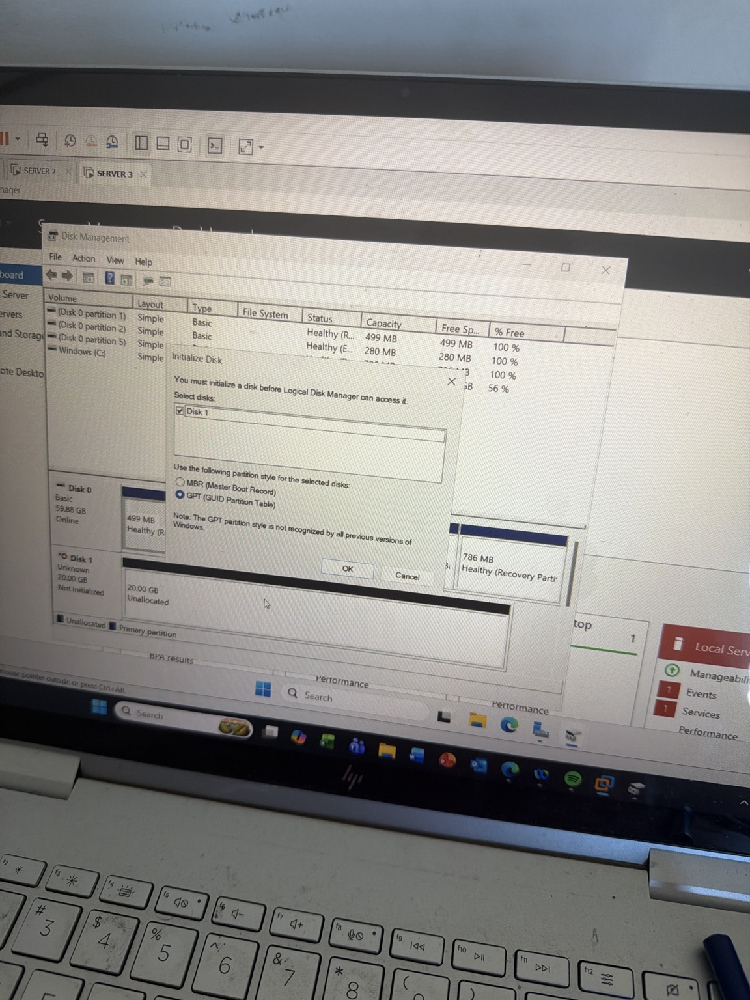
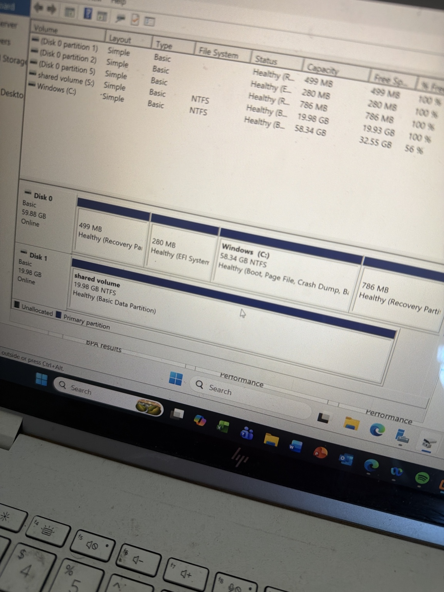
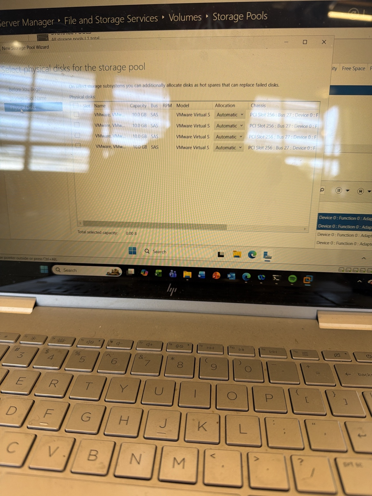
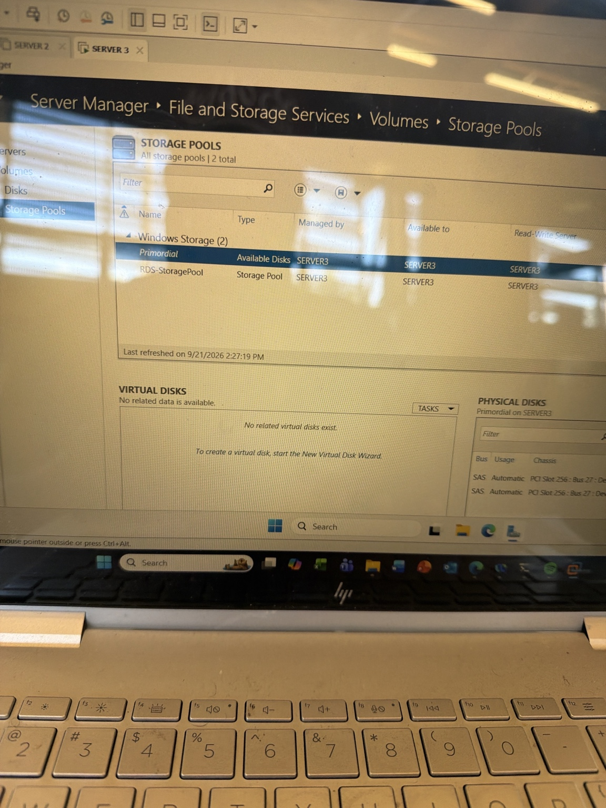
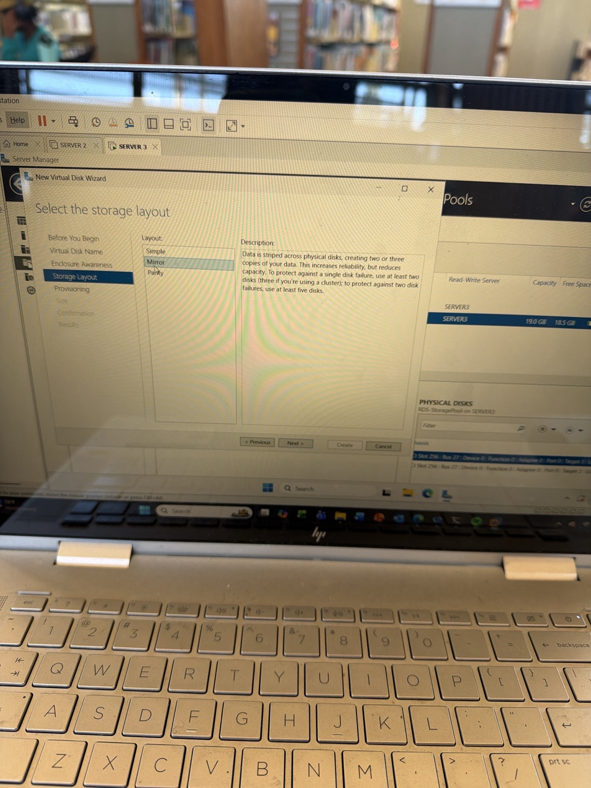
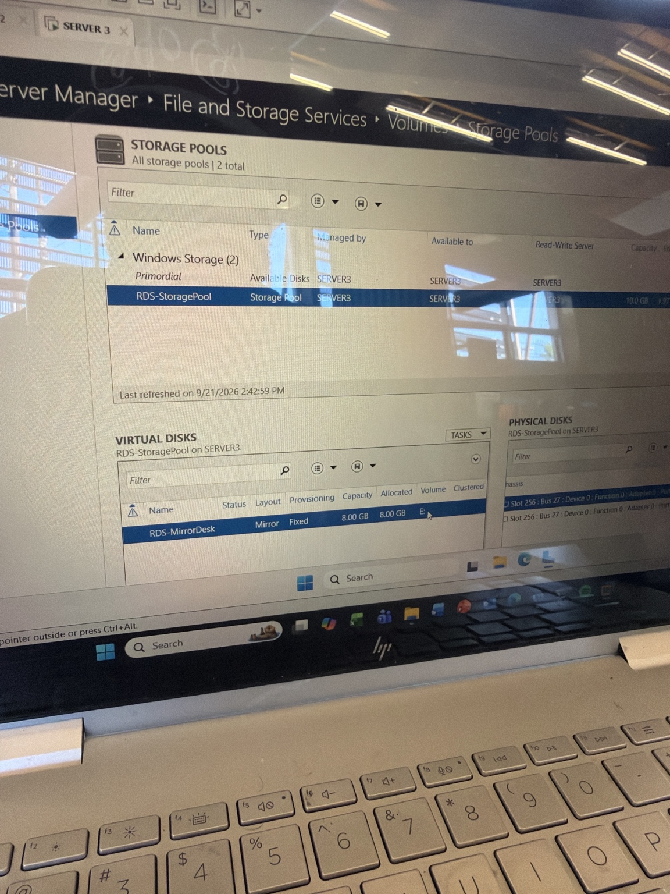

# Windows Server Storage Spaces Lab

## Overview

In this lab, I learned how Windows Server manages disks, volumes, and Storage Spaces.

I first created and configured a new virtual disk in VMware, initialized it in Windows Server, created a simple volume, formatted it with NTFS, and assigned a drive letter.

I then created a Storage Pool using multiple virtual disks and configured a mirrored virtual disk for resiliency.

## Lab Environment

- Virtualization Platform: VMware Workstation
- Server: SERVER3
- Domain: bobby.local
- Operating System: Windows Server
- Storage Management Tools:
  - Disk Management
  - Server Manager
  - File and Storage Services

## Part 1: Disk and Volume Management

I added a new 20 GB virtual SCSI disk to SERVER3.

In Disk Management, the new disk initially appeared as:

- Unknown
- Offline
- Unallocated

I brought the disk online and initialized it using GPT.

### GPT vs MBR

I learned that GPT is the modern partition style and is preferred for modern Windows Server systems.

MBR is an older partition style with more limitations, including support for smaller disk sizes and fewer partitions.

## Creating a Simple Volume

After initializing Disk 1 as GPT, I created a new simple volume.

Configuration:

- Disk: Disk 1
- Size: approximately 20 GB
- File system: NTFS
- Volume label: shared volume
- Drive letter: S:

The result was a healthy NTFS volume that could be used for file storage.

## Part 2: Storage Spaces

I added multiple additional 10 GB virtual disks to SERVER3.

Using Server Manager, I opened:

File and Storage Services → Storage Pools

I created a new Storage Pool named:

RDS-StoragePool

The pool used two 10 GB physical disks.

## Creating a Mirrored Virtual Disk

Inside the storage pool, I created a virtual disk named:

RDS-MirrorDesk

Configuration:

- Storage layout: Mirror
- Provisioning type: Fixed
- Virtual disk size: 8 GB

A mirrored layout was selected because it stores duplicate copies of data across multiple disks.

This provides resiliency if one physical disk fails.

## Creating the Volume

After creating the mirrored virtual disk, I created a new NTFS volume.

Configuration:

- Virtual disk: RDS-MirrorDesk
- Volume size: approximately 7.98 GB
- Drive letter: E:
- File system: NTFS
- Volume label: RDS-MirrorVolume

The final result was a usable mirrored volume presented to Windows as drive E:.

## Storage Spaces Structure

The storage flow in this lab was:

Physical Disks
↓
Storage Pool
↓
Virtual Disk / Storage Space
↓
Volume
↓
Drive Letter

For this lab:

Two 10 GB Physical Disks
↓
RDS-StoragePool
↓
RDS-MirrorDesk
↓
RDS-MirrorVolume
↓
E:

## What I Learned

I learned the difference between:

- A disk
- A volume
- A partition style
- A storage pool
- A virtual disk
- A Storage Space

I also learned that:

- GPT is the preferred modern partition style.
- A disk must be online and initialized before it can be used.
- A volume must be created, formatted, and assigned a drive letter before users can store files on it.
- Storage Spaces can combine multiple disks into one pool.
- A mirrored Storage Space provides redundancy by storing multiple copies of data.
- Mirroring reduces usable capacity because space is used for duplicate data.

## Key Concepts

### Disk
The physical or virtual storage device.

### Volume
Usable storage created from disk space.

### GPT
A modern partition style used to organize partitions on a disk.

### Storage Pool
A collection of physical disks combined together.

### Virtual Disk
Storage created from the storage pool.

### Mirror
A resiliency layout that keeps duplicate copies of data across multiple disks.

### NTFS
The file system used to format the volume and store files.
## Lab Evidence

### New Disk Before Configuration

### GPT Initialization

### Simple Volume Created

### Physical Disks Available for Storage Pool

### Storage Pool Created

### Mirror Storage Layout

### Final Mirrored Storage Space

